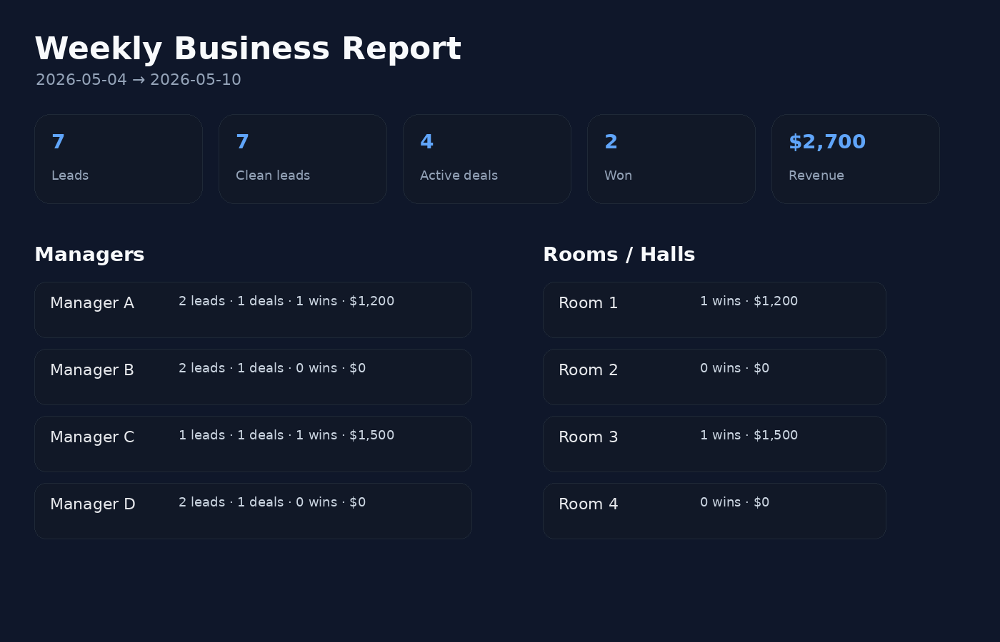

# Business Reporting Pipeline

A public-safe version of a real weekly CRM reporting pipeline used for service-business operations.

The original private workflow pulls data from Bitrix24, calculates manager / room / package metrics, and produces a founder-ready weekly report. This repository removes production inputs and credentials, but keeps the actual reporting shape: CRM input adapters, config-driven field mapping, weekly metrics, Markdown/JSON outputs, and a generated visual snapshot.

## Screenshot



## What remains from the real project

- Bitrix24-style CRM extraction adapter
- config-driven CRM custom fields
- weekly period handling
- manager performance block
- room/hall revenue block
- package vs hourly split
- dirty vs clean lead handling
- JSON + Markdown output
- generated visual snapshot for sharing

## What was removed

- production webhook URL
- live CRM data
- client names, phones, chats, calls
- production Google Sheets writer
- internal file paths
- project-specific names

## Quick start with sample data

```bash
python3 -m venv .venv
source .venv/bin/activate
pip install -r requirements.txt
python src/weekly_report.py --sample-data sample_data --week 2026-05-04 2026-05-10
python src/report_snapshot.py
```

Outputs:

```text
out/weekly_report.json
out/weekly_report.md
docs/assets/weekly-report-snapshot.png
```

## Use with your own CRM export

Replace:

```text
sample_data/leads.json
sample_data/deals.json
```

or adapt `config/report_config.example.json` to your CRM field names.

For Bitrix24, set:

```bash
export BITRIX_WEBHOOK_URL="https://your-domain.bitrix24.com/rest/.../"
python src/weekly_report.py --config config/report_config.example.json --sample-data ""
```

## Data contract

Leads need:

- `ID`
- `DATE_CREATE`
- `STATUS_ID`
- `ASSIGNED_BY_ID`
- unqualified flag field from config

Deals need:

- `ID`
- `DATE_CREATE`
- `STAGE_ID`
- `OPPORTUNITY`
- booking manager field from config
- source marker field from config
- booking date field from config
- hall/room field from config
- package type field from config

## License

MIT
